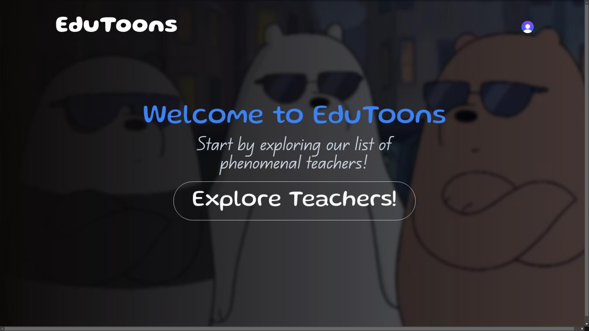
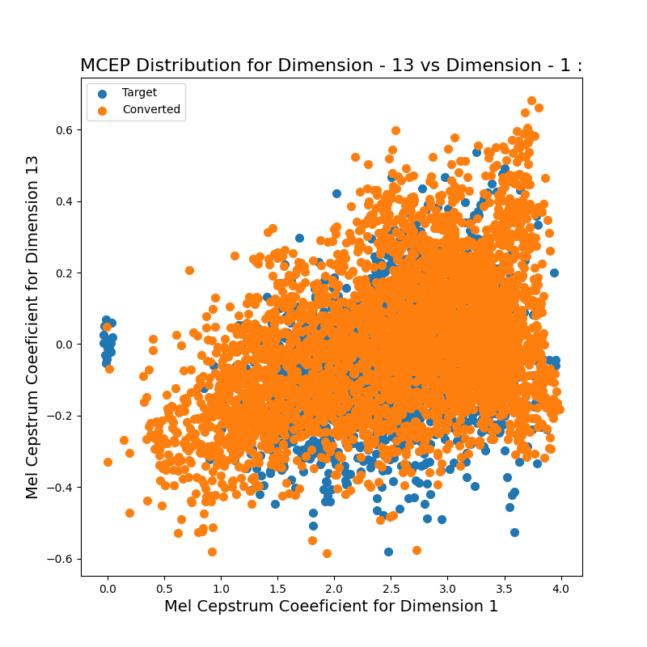
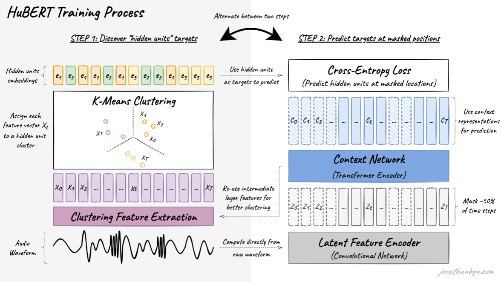

# EduToons: AI-Driven Educational Animation Platform




## Academic Research Project

EduToons is an innovative e-learning platform that transforms traditional teaching materials into engaging animated content using advanced AI technologies. This research project addresses the challenge of maintaining young learners' interest in online education through the integration of voice cloning and animation technologies.

## 🎯 Research Objectives

- Develop an AI-driven system for creating interactive and engaging learning experiences
- Transform traditional teaching content into animated character-based lessons
- Implement voice cloning technology for authentic character voicing
- Create an interactive learning environment with real-time Q&A capabilities

## 🔬 Technical Implementation

### Voice Conversion System
- **RVC Model**: Utilizes Retrieval-based Voice Conversion
- **HuBERT Integration**: Implements Hidden-Unit BERT model for feature extraction
- **Performance Metrics**:
  - Mel-Cepstral Distortion (MCD): 10.059 dB
  - logF0_RMSE: 0.238
  - Mean Opinion Score (MOS): 2.958
  - Speaker Verification Accept Rate: 1.0

### Video Processing Pipeline


- **Motion Capture**: MediaPipe for pose estimation and landmark detection
- **3D Animation**: Blender integration for character rigging and animation
- **Character Rendering**: Custom pipeline for seamless character animation

### Web Platform Architecture
- **Frontend**: Next.js
- **Authentication**: Clerk.js 
- **Database**: MySQL for data management
- **Backend**: Flask-based API services

## 📊 Experimental Results

### Dataset Characteristics
- Custom-created educational video dataset
- Duration: 10-20 seconds per video
- Focus on full-body visibility and simple movements
- Content: Educational lessons and stories for children

### Performance Evaluation
 

- **Voice Conversion Quality**:
  - Spectral analysis through MCEP trajectories
  - Global Variance (GV) measurements
  - Subjective evaluation through MOS testing

## 🛠️ Technical Stack

### Voice Processing Tools


- Google Colab (Model Training)
- FFmpeg (Audio Processing)
- RVC (Voice Cloning)
- huBERT (Feature Extraction)
- RMVPE (Frequency Estimation)

### Animation Tools


- MediaPipe (Pose Detection)
- Blender (3D Animation)
- AccuRIG (Character Rigging)
- BlendArMocap (Motion Capture)

### Web Development
- Next.js (Frontend Framework)
- Tailwind CSS (Styling)
- Flask (Backend API)
- MySQL (Database)
- Git (Version Control)

## 🎓 Academic References

1. Xiao, L. "Animation Trends in Education." International Journal of Information and Education Technology
2. Hsu, W. et al. "HuBERT: Self-supervised speech representation learning by masked prediction of hidden units." IEEE/ACM transactions
3. Leng, Y. et al. "MBNet: MOS prediction for synthesized speech with mean-bias network." ICASSP 2021
4. Wu, Z., & Li, H. "Voice conversion versus speaker verification: an overview." APSIPA Transactions

## 🔄 Future Development

1. **Voice Quality Enhancement**
   - Improve spectral quality of converted speech
   - Reduce artificial artifacts in voice output

2. **Platform Expansion**
   - Additional language support beyond Arabic and English
   - Enhanced interactive features
   - Integration with existing LMS platforms

3. **Technical Improvements**
   - Scalability optimization
   - Performance enhancements
   - Real-time processing capabilities

## 📝 Citation

If you use this work in your research, please cite:

```bibtex
@article{edutoons2024,
  title={EduToons: AI-Driven Educational Animation Platform},
  authors={[Mohamed Ashraf Mohamed,
            Mohamed Ashraf AbdElnabi,
            Youssef Mohamed AbdElaal,
            Youssef Shehata Shaaban,
            Saif Adel AbdElghany,
            Samy Ahmed Samy,
          ]},
  year={2024}
}
```

## 🤝 Acknowledgments

This research was conducted as part of a graduation project at Ain Shams University. Special thanks to the faculty advisors and research participants who contributed to this work.

## 📄 License

This project is licensed under the MIT License - see the [LICENSE](LICENSE) file for details.
